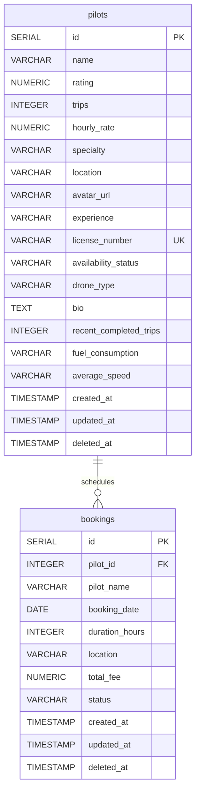

# Entity Relationship Diagram & Schema Details

This directory documents the database layer structure, indexing layouts, and auditing fields for BharatAero.

## Entity Relationship Diagram

## Schema Documentation

### 1. `pilots` Table
*   `id` (Integer, Serial): Primary key.
*   `name` (Varchar, Not Null): Full name of the pilot.
*   `rating` (Numeric, Check: 0 to 5.0): Rating score of the pilot.
*   `hourly_rate` (Numeric, Check: >0): Charged rate in INR per hour.
*   `specialty` (Varchar): Primary specialized skill (e.g., "Aerial Mapping", "Cinematography").
*   `location` (Varchar): Work location city.
*   `license_number` (Varchar, Unique): Official drone operating license key.
*   `availability_status` (Varchar): Pilot availability state (e.g., 'Immediate', 'Tomorrow', 'Weekend').
*   `deleted_at` (Timestamp, Nullable): Used for soft deletes. If set, this pilot is excluded from active search results.

**Optimizations & Indexes:**
*   `idx_pilots_location` (B-Tree): Index on `location` filtered on `deleted_at IS NULL` to speed up location searches.
*   `idx_pilots_specialty` (B-Tree): Index on `specialty` filtered on `deleted_at IS NULL` to speed up filter lists.
*   `idx_pilots_rating` (B-Tree): Index on `rating DESC` to speed up listings sorted by top rating.

---

### 2. `bookings` Table
*   `id` (Integer, Serial): Primary key.
*   `pilot_id` (Integer, FK references `pilots(id)`): Link to the scheduled pilot.
*   `pilot_name` (Varchar, Not Null): Denormalized pilot name cache for fast rendering.
*   `booking_date` (Date, Not Null): Date of the flight booking.
*   `duration_hours` (Integer, Check: >0): Duration of the booking in hours.
*   `location` (Varchar): Location of the drone operation.
*   `total_fee` (Numeric, Check: >=0): Calculated cost (hourly_rate * duration_hours).
*   `status` (Varchar): Status of the transaction (e.g. 'Confirmed', 'Cancelled', 'Completed').

**Optimizations & Indexes:**
*   `idx_bookings_pilot_id` (B-Tree): Speeds up history retrieval of bookings associated with a pilot.
*   `idx_bookings_date` (B-Tree): Index on `booking_date` to support scheduling logic checking.
